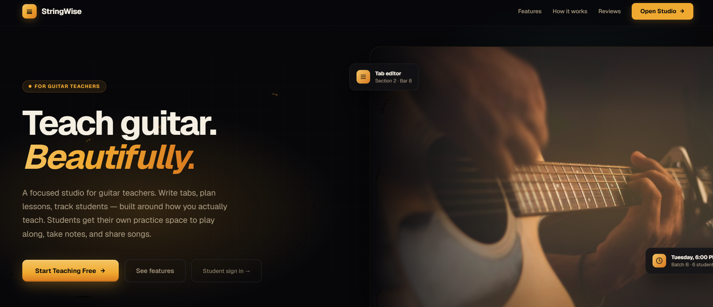
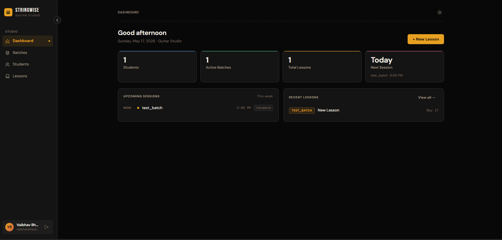
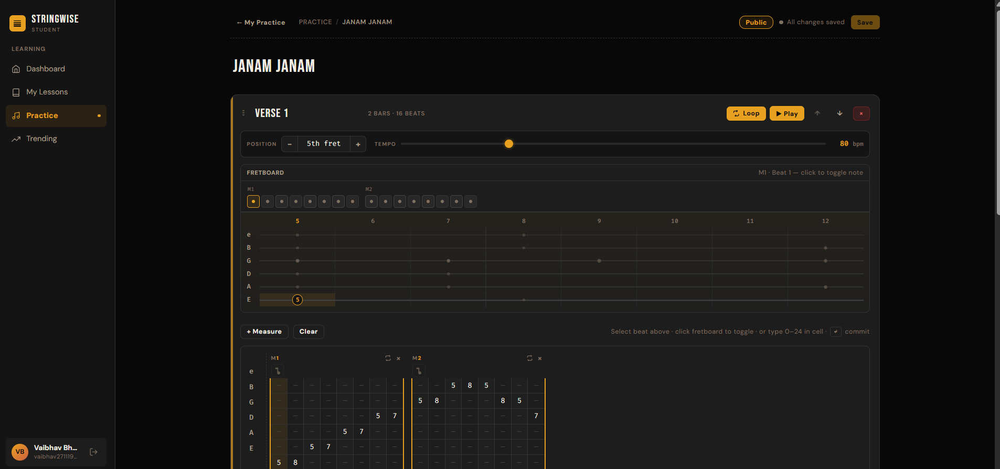
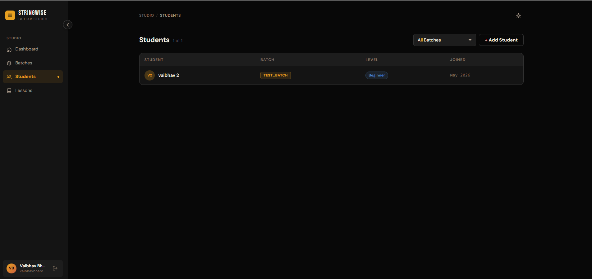

# StringWise — Guitar Teaching Studio

> A full-stack web application for guitar teachers to manage students, write tab notation, and deliver lessons — with a student portal for practice, audio recording, and community sharing.

**Live:** [string-wise.com](https://string-wise.com) &nbsp;·&nbsp; **App:** [app.string-wise.com](https://app.string-wise.com)

---

## Screenshots

### Landing Page


### Teacher Dashboard


### Tab Editor — Student Practice


### Student Management


---

## What It Does

**For teachers:**
- Create batches (class groups) with schedules
- Add students and assign them to batches
- Write multi-section guitar tab notation directly in the browser — fret input, tempo, loop markers, beat-by-beat playback
- Attach YouTube lesson videos and written notes to each lesson
- Upload audio clips per measure (backing tracks, reference recordings) via Cloudflare R2

**For students:**
- Personal practice space — create and save songs with the same tab editor
- Record or upload audio per measure, synced to tab playback
- Toggle songs public/private — public songs appear on the Trending feed
- View any public song's full tab in read-only mode

**Public / unauthenticated:**
- Landing page shows live trending songs with in-browser audio playback (Tone.js)
- `/trending` and `/songs/:id` routes accessible without login

---

## Tech Stack

| Layer | Technology | Why |
|---|---|---|
| **Frontend** | React 18 + Vite | Fast HMR, minimal build config |
| **Backend** | Go + Gin | Low-latency API, compiled binary |
| **Database** | Supabase (Postgres) | Row-level security, managed auth |
| **Auth** | Supabase Auth (Google OAuth) | ES256 JWT, teacher/student roles |
| **Audio storage** | Cloudflare R2 | Zero egress fees vs S3 |
| **Audio playback** | Tone.js + FluidR3_GM sampler | Steel guitar samples with PluckSynth fallback |
| **Video** | YouTube embed | No API quota issues; teacher uploads manually |
| **Infra** | Docker Compose + nginx | Self-hosted on Raspberry Pi 5 |

---

## Architecture

```
┌─────────────────────┐     ┌─────────────────────┐
│   landing (3001)    │     │   frontend (3000)    │
│   React + Vite      │     │   React + Vite       │
│   nginx reverse     │     │   Vite dev proxy     │
│   proxy → backend   │     │   → backend          │
└────────┬────────────┘     └──────────┬───────────┘
         │                             │
         └──────────┬──────────────────┘
                    ▼
         ┌──────────────────┐
         │  backend (8080)  │
         │  Go + Gin        │
         │  JWT middleware  │
         │  (ES256 + HS256) │
         └────────┬─────────┘
                  │
       ┌──────────┴──────────┐
       ▼                     ▼
  Supabase Postgres     Cloudflare R2
  (auth + data)         (audio files)
```

**Key design decisions:**
- Vite proxy (`/api → backend`) eliminates CORS — browser makes same-origin requests regardless of how the server is accessed
- `OptionalAuth` middleware on public routes enriches responses with `my_reaction` when a JWT is present, without requiring one
- Sections stored as JSONB in `practice_songs` — flexible schema, no JOIN overhead for reads
- Audio upload open to all authenticated users; ownership enforced at the file level (`uploader_id` stored as `teacher_id`)

---

## Database Schema

```sql
-- Teacher side
batches        (id, teacher_id, name, schedule, color)
students       (id, teacher_id, batch_id, user_id, name, level)
lessons        (id, teacher_id, batch_id, title, youtube_url, notes, sections jsonb)
measures       (id, section_id, beats jsonb)
audio_files    (id, measure_id, teacher_id, r2_key, name)

-- Student side
practice_songs (id, student_user_id, title, sections jsonb, visibility)
song_reactions (id, song_id, user_id, reaction)  -- 'like' | 'dislike'
```

---

## API Routes

| Method | Path | Auth | Description |
|--------|------|------|-------------|
| `POST` | `/api/v1/auth/me` | JWT | Resolve role, upsert user record |
| `GET/POST/PUT/DELETE` | `/api/v1/batches` | Teacher | Batch CRUD |
| `GET/POST/PUT/DELETE` | `/api/v1/lessons` | Teacher | Lesson CRUD |
| `GET/POST/PUT/DELETE` | `/api/v1/practice` | Student | Practice song CRUD |
| `GET` | `/api/v1/trending` | Optional | Public songs, enriched with `my_reaction` if authed |
| `GET` | `/api/v1/trending/:id/sections` | None | Raw sections JSONB for playback |
| `POST` | `/api/v1/trending/:id/react` | Student | Like / dislike / remove reaction |
| `POST` | `/api/v1/audio/upload` | Any user | Multipart upload → Cloudflare R2 |
| `DELETE` | `/api/v1/audio/:id` | Owner | Delete own audio file |

---

## Running Locally

**Prerequisites:** Docker, Docker Compose

```bash
# Clone
git clone https://github.com/VA-ibh-AV/stringwise.git
cd stringwise

# Configure environment
cp .env.example .env
# Fill in: DATABASE_URL, SUPABASE_JWT_SECRET, R2_* credentials

# Start all services
docker compose up

# Landing:  http://localhost:3001
# App:      http://localhost:3000
# API:      http://localhost:8080
```

**Frontend dev (hot reload):**
```bash
cd frontend && npm install && npm run dev
```

**Backend dev:**
```bash
cd backend && go run ./cmd/server
```

---

## Project Structure

```
stringwise/
├── backend/
│   ├── cmd/server/          # Entry point
│   ├── internal/
│   │   ├── handlers/        # lessons, practice, trending, audio
│   │   ├── middleware/       # Auth, OptionalAuth, teacher role guard
│   │   ├── models/          # Shared request/response structs
│   │   ├── router/          # Route registration
│   │   └── storage/         # R2 client (presign, put, delete)
│   └── migrations/          # SQL migrations (001–004)
├── frontend/
│   └── src/
│       ├── pages/student/   # Dashboard, Practice, SongEditor, SongViewer
│       ├── pages/           # Teacher: Dashboard, Batches, Students, Lessons
│       ├── components/      # SongCard, Sidebar, TabEditor
│       ├── audio.js         # Tone.js sampler + PluckSynth fallback
│       └── api.js           # Typed fetch wrapper
└── landing/
    ├── src/components/      # Hero, Features, Trending, CTA, Footer
    ├── src/audio.js         # Same audio engine as frontend
    └── nginx.conf           # /api proxy → backend
```

---

## Notable Implementation Details

**Tab Editor**
Beat-by-beat 6-string tab input with interactive fretboard. Multiple sections per song, configurable tempo, loop playback per section, per-measure audio clips. Plays via Tone.js FluidR3_GM steel guitar samples with PluckSynth synthesis as fallback. `readOnly` prop enables the same component as a viewer for the public song page.

**Trending Feed**
Public songs ranked by net likes. Plays back in-browser on landing and app — if a measure has a recorded audio clip it plays that; otherwise synthesizes the tab notes. Accessible without login. `OptionalAuth` middleware attaches `my_reaction` to each song when a valid JWT is present.

**Audio Recording**
Browser mic recording via MediaRecorder API or file upload, attached per measure. POSTed directly to the backend, then stored in Cloudflare R2. The `audio_file` object is written back into the sections JSONB on save so it survives reloads.

**Dual-surface Design**
Landing page and app are independent Vite apps sharing no code at runtime. The landing fetches `/api` via an nginx reverse proxy and renders its own Trending component with full Tone.js playback — no iframe, no cross-origin issues, no sandbox restrictions.
